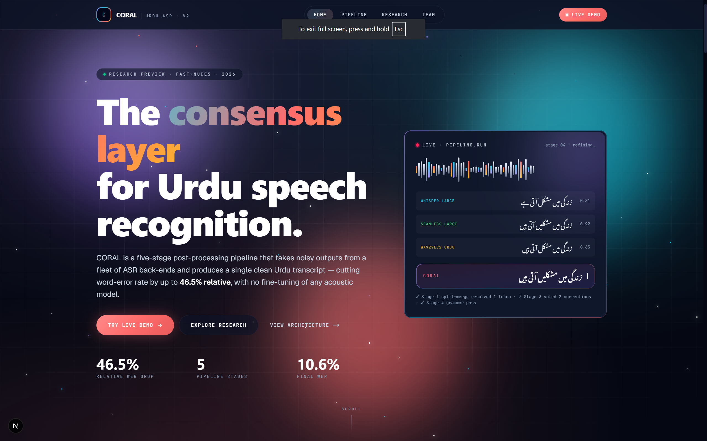
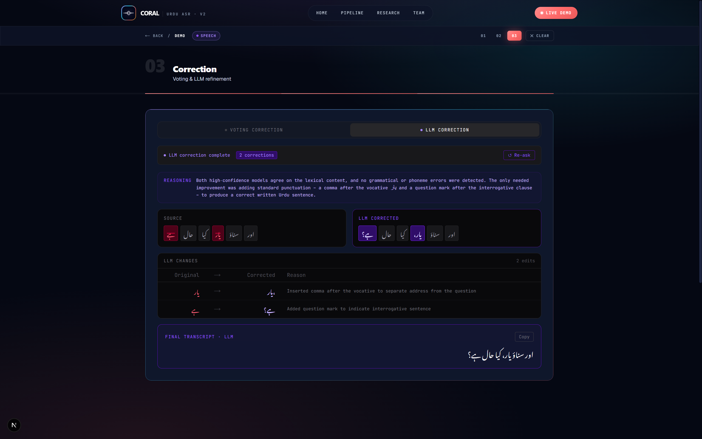

# CORAL — Consensus-Based Refinement and Output Realignment

> Five-stage Urdu ASR post-processing pipeline that turns a noisy ensemble of speech-recognition models into a single clean Urdu transcript — cutting Word Error Rate by up to **46.5% relative**, without retraining any acoustic model.

<div align="center">

[](https://www.python.org/downloads/)
[](https://fastapi.tiangolo.com/)
[](https://nextjs.org/)
[](https://react.dev/)
[](LICENSE)

</div>

<p align="center">
  
</p>

---

## Overview

CORAL is a research-grade Urdu ASR post-correction platform built across two iterations of the FAST-NUCES Final Year Project. It treats word-boundary disagreement between ASR back-ends as a first-class signal, runs a hybrid lexical + n-gram correction layer over the ensemble, and refines the voted output through a bounded LLM pass. All five stages are deterministic except for the optional final LLM polish.

The deliverable is an end-to-end product:

- A **research website** with a cinematic dark-mode landing page, a per-stage pipeline walkthrough, an interactive results dashboard, a team page, and an in-browser demo.
- A **FastAPI orchestrator** deployed to a HuggingFace Space, exposing the pipeline endpoints plus a Kaggle-GPU model registry.
- A **distributed ASR back-end** where each acoustic model self-registers from a Kaggle GPU notebook via an ngrok HTTPS tunnel.

<p align="center">
  
</p>

---

## Headline Results

| Suite                                        | Source Model           | Baseline WER | CORAL WER | Δ Relative  |
|----------------------------------------------|------------------------|:------------:|:---------:|:-----------:|
| Common Voice Urdu · 2,995 utterances         | Seamless-Large         | 18.45%       | 14.34%    | ↓ 22.3%     |
| Common Voice Urdu                            | Whisper-Large-v3       | 28.29%       | 19.97%    | ↓ 29.4%     |
| Common Voice Urdu                            | Whisper-Medium         | 40.44%       | 30.64%    | ↓ 24.2%     |
| Common Voice Urdu                            | Wav2Vec2-Urdu          | 53.52%       | 39.67%    | ↓ 25.9%     |
| **Conversational Urdu · 500 clips · C7**     | **Whisper-Large-v3**   | **19.8%**    | **10.6%** | **↓ 46.5%** |

Ablation (Whisper-Large-v3 on conversational Urdu): `C0 19.8 → C7 10.6%` — every stage contributes a measurable, additive drop.

---

## The Five-Stage Pipeline

| Stage | Name                       | What it does |
|-------|----------------------------|--------------|
| 00    | **Urdu Normalisation**     | Arabic ↔ Urdu Unicode unification · diacritic / hamza / tatweel removal — alone worth 1.9 WER pts. |
| 01    | **Split-Merge Alignment**  | Weighted multi-sequence alignment, classifying every chunk SAME / SPLIT / MERGE / NOISE. 36.5% of inter-model events are SPLIT or MERGE. |
| 02    | **OOV + BK-tree**          | OOV detection + BK-tree fuzzy lookup over a 500K-word Urdu corpus, re-ranked by an n-gram language model. |
| 03    | **Consensus Voting**       | Conservative position-wise voting; source-biased tie-breaking; OOV-aware overrides. |
| 04    | **LLM Refinement**         | Bounded LLM polish — fixes gender agreement, izafat, postpositions, code-switching. Constrained by upstream metadata. |

---

## Quick Start

### 1. Backend

```bash
cd coral_app/backend
python -m venv venv
venv\Scripts\activate          # Windows
pip install -r requirements.txt

# Create .env (see Configuration)
uvicorn main_app:app --reload --port 8000
```

> First boot downloads ~200 MB from HuggingFace Hub (BK-tree + n-gram Parquet). Watch for **"All ngrams ready"** before sending requests.

### 2. Frontend

```bash
cd coral_app/frontend/my-next-app
npm install

# Create .env (see Configuration)
npm run dev
```

### 3. Open

| Surface          | URL                                  |
|------------------|--------------------------------------|
| Web app (root)   | http://localhost:3000                |
| Pipeline page    | http://localhost:3000/pipeline       |
| Research page    | http://localhost:3000/research       |
| Team page        | http://localhost:3000/team           |
| Interactive demo | http://localhost:3000/app            |
| API (Swagger)    | http://localhost:8000/docs           |
| Live ASR list    | http://localhost:8000/registry/models|

---

## Configuration

**`coral_app/backend/.env`**

```env
HF_TOKEN=hf_your_token
BUCKET_URL=https://huggingface.co/buckets/EliIrfan/coral_cc_100_extracted_data
REPO_ID=EliIrfan/coral_cc_100_extracted_data
REGISTRY_SECRET=your-registry-secret
API_SECRET=your-api-secret
EVICT_AFTER_SEC=300
MAX_AUDIO_MB=25
ALLOWED_HOSTS=ngrok-free.app,ngrok.io
```

**`coral_app/frontend/my-next-app/.env`**

```env
NEXT_PUBLIC_API_URL=https://eliirfan-coral-back-end.hf.space
# NEXT_PUBLIC_API_URL=http://localhost:8000          # for local backend
NEXT_PUBLIC_HF_TOKEN=hf_your_token
NEXT_PUBLIC_API_SECRET=your-api-secret

# Stage 4 — single chat endpoint (GPT-OSS via aki.io)
NEXT_PUBLIC_AKI_URL=https://aki.io/api/call/gpt_oss_chat
NEXT_PUBLIC_AKI_KEY=your-aki-key
```

---

## Architecture

```
Frontend (Next.js 16 · React 19 · TypeScript · TailwindCSS v4)
  /        Landing — hero + animated waveform + KPI counters
  /pipeline    Per-stage walkthrough with Urdu examples
  /research    Results dashboard · ablation chart · residual analysis
  /team        Team + supervisors + institution panel
  /app         Interactive demo · Pass 1 → 2 → 3
       │
       │ REST API
       ▼
Backend (FastAPI · Docker · HuggingFace Space port 7860)
  ├─ Pipeline:   POST /align  /oov  /correct           GET /health
  └─ Registry:   GET  /registry/models
                 POST /registry/register · /ping · /transcribe

Data Tier
  ├─ HuggingFace Hub → bk_tree.joblib + n-gram Parquet → DuckDB on startup
  └─ Eval TSVs:  corpus/  asr_results/  asr_ensemble/  asr_evaluation/

Distributed Inference (per model)
  └─ Kaggle GPU notebook → ngrok HTTPS tunnel → /registry/register + /ping

Stage 4 LLM (client-side)
  └─ aki.io · gpt_oss_chat   (single bounded endpoint)
```

For the full topology (4-tier system architecture and deployment topology) see the FYP-2 final report and `docs/report/CORAL-FYP-Presentation.pptx`.

---

## API Endpoints

| Method | Path                    | Auth                | Description                                  |
|:------:|-------------------------|---------------------|----------------------------------------------|
| `GET`  | `/health`               | —                   | Health check                                 |
| `POST` | `/align`                | —                   | Weighted split-merge-aware alignment         |
| `POST` | `/oov`                  | —                   | OOV detection + ranked BK-tree candidates    |
| `POST` | `/correct`              | —                   | Conservative voting correction               |
| `GET`  | `/registry/models`      | —                   | List live registered ASR nodes               |
| `POST` | `/registry/register`    | `X-Registry-Token`  | Kaggle notebook self-registration            |
| `POST` | `/registry/ping`        | `X-Registry-Token`  | Heartbeat (every 60 s)                       |
| `POST` | `/registry/transcribe`  | `X-Api-Token`       | Fan-out audio to every live whitelisted model|

---

## Frontend Workflow

### Mode select
- **File** — upload a CSV / TSV / JSON with one column per ASR model.
- **Speech** — drag-drop / record audio, or paste model outputs manually if no Kaggle nodes are live.

### Pass 1 — Alignment
File mode: map columns to model names → `POST /align`.
Speech mode: select live models → `POST /registry/transcribe` (fan-out) → `POST /align`.
Manual fallback when the registry is empty: type two or more transcripts and run alignment directly.

### Pass 2 — OOV Sieve
`POST /oov` then an animated 4-phase scan:
1. **Sieve** — violet cursor sweeps the token stream
2. **Word-colour** — MATCH / INSERTION / DELETION / SUBSTITUTION tags
3. **Expand** — switch to character-level split-merge view
4. **Meta-colour** — SAME / SPLIT / MERGE / NOISE structural tags

OOV tokens are flagged with a rose dotted underline; clicking reveals ranked BK-tree candidates with scores.

### Pass 3 — Correction
Toggle between two side-by-side modes:

- **Voting** — `POST /correct` → majority vote + OOV override · token diff · change-rate progress bar.
- **LLM**    — client-side POST to the GPT-OSS chat endpoint with an Urdu computational-linguist system prompt; returns `{ corrected, reasoning, changes[] }` with linguistic justification per edit.

---

## Kaggle Notebook Deployment

For live speech transcription, run any notebook from `model_deploy_kaggle_notebooks/`:

1. Open in Kaggle and enable a GPU accelerator (T4 / P100).
2. Set Kaggle secrets: `REGISTRY_SECRET`, `BACKEND_URL`.
3. Run all cells — the notebook will:
   - Load the ASR model on GPU
   - Start a FastAPI inference server
   - Expose it via an ngrok HTTPS tunnel
   - Self-register with `POST /registry/register`
   - Send heartbeats every 60 s via `POST /registry/ping`

Models silent for 300 s are automatically evicted from the registry.

---

## Project Structure

```
CORAL-Urdu-ASR/
├── README.md
├── urdu_asr_benchmark.ipynb          # Offline model inference on corpus
├── urdu_asr_pipeline.ipynb           # Ensemble + evaluation pipeline
├── generate_ngrams.ipynb             # n-gram + BK-tree generation for HF upload
│
├── corpus/                           # Reference transcriptions (TSV)
├── audios/                           # Raw audio files (WAV/MP3)
├── vocab/                            # Vocabulary index
├── metadata/                         # clip_durations.tsv
├── asr_results/                      # Per-model raw predictions
├── asr_ensemble/                     # Ensemble outputs
├── asr_evaluation/                   # WER/CER evaluation metrics
├── checkpoints/                      # Model training checkpoints
│
├── model_deploy_kaggle_notebooks/
│   ├── whisper_large_kaggle.ipynb
│   └── seamless_large_kaggle.ipynb
│
├── coral_app/
│   ├── backend/
│   │   ├── main_app.py               # Unified FastAPI entry
│   │   ├── requirements.txt
│   │   ├── Dockerfile
│   │   ├── .env
│   │   ├── pipeline/                 # /align /oov /correct + algorithms
│   │   └── model_registery/          # Registry router
│   │
│   └── frontend/my-next-app/
│       ├── .env
│       ├── package.json
│       └── app/
│           ├── layout.tsx                  # Nav + Footer shell
│           ├── page.tsx                    # Landing
│           ├── pipeline/page.tsx           # Stage walkthrough
│           ├── research/page.tsx           # Results dashboard
│           ├── team/page.tsx               # Team + supervisors
│           ├── app/page.tsx                # Interactive demo shell
│           ├── ModeSelector.tsx
│           ├── Pass0Speech.tsx · Pass1Input.tsx · Pass2Sieve.tsx · Pass3Correction.tsx
│           ├── components/                 # Nav, Footer, Waveform, ParticleField, Counter, Reveal, TechStack
│           └── lib/api.ts                  # Typed API client
│
└── docs/
    ├── report/
    │   ├── FYP2-FinalReport-F25-189-R-CORAL.pdf
    │   ├── CORAL-FYP-Presentation.pptx
    │   └── build_slides.py
    └── ...                                 # Architecture and pipeline diagrams
```

---

## Models

| Model                   | Parameters | Kaggle Notebook                    |
|-------------------------|:----------:|------------------------------------|
| Seamless-M4T v2 Large   | 2.4 B      | `seamless_large_kaggle.ipynb`      |
| Whisper-Large-v3        | 1.5 B      | `whisper_large_kaggle.ipynb`       |
| Whisper-Medium          | 769 M      | —                                  |
| Wav2Vec2-Urdu           | 317 M      | —                                  |

---

## Team

| Member          | Roll      | Role                                              |
|-----------------|-----------|---------------------------------------------------|
| Ali Irfan       | 21I-2572  | Pipeline architect · Backend & HF deployment      |
| Nouman Hafeez   | 21I-0416  | Corpus + retrieval · Web app · LLM strategy       |
| Rafay Khattak   | 21I-0423  | Research pitch · Evaluation lead                  |

**Supervised by** Ms. Kainat Iqbal and Ms. Saira Qamar — Dept. of Artificial Intelligence & Data Science.
**Affiliation** — Dept. of Computer Science · FAST School of Computing · **FAST-NUCES Islamabad**.

---

## Documentation

- [`docs/report/FYP2-FinalReport-F25-189-R-CORAL.pdf`](docs/report/FYP2-FinalReport-F25-189-R-CORAL.pdf) — the full FYP-2 report (97 pages).
- [`docs/report/CORAL-FYP-Presentation.pptx`](docs/report/CORAL-FYP-Presentation.pptx) — 32-slide deck with the figures from the report wired in.
- `docs/architecture/` and `docs/pipeline/` — Mermaid diagrams that render on GitHub.

---

## License

MIT License — see [LICENSE](LICENSE).
