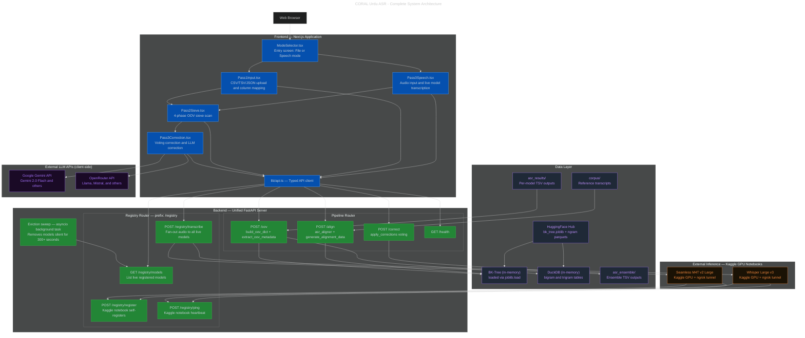

# System Architecture

> High-level topology of the CORAL Urdu ASR system showing all layers, components, and communication paths.

---

## Diagram

---

## Layer Summary

| Layer | Technology | Role |
|---|---|---|
| **Presentation** | Next.js 14, React 18, TypeScript | User interface across all 3 passes |
| **Application** | FastAPI 0.109, Uvicorn, Python 3.12 | REST API, model registry, eviction |
| **Data** | HuggingFace Hub, DuckDB, joblib | BK-Tree + n-gram lookup tables |
| **External Inference** | Kaggle GPU, ngrok | Live ASR model transcription |
| **LLM Correction** | Gemini API, OpenRouter API | Expert post-correction (client-side) |

→ [Back to docs index](../README.md)
