# System Components

> Detailed backend component graph showing all functions, routes, data structures, authentication, and LLM integration.

---

## Diagram

```mermaid
---
title: CORAL Urdu ASR - Backend System Components and Dependencies
config:
  theme: dark
  primaryColor: '#161b22'
  primaryBorderColor: '#30363d'
  lineColor: '#58a6ff'
  fontSize: 11
---

graph TB

    subgraph MainApp["Unified FastAPI Entry — main_app.py"]
        AppEntry["Mounts Pipeline Router<br/>Mounts Registry Router at /registry prefix<br/>Starts eviction sweep background task<br/>Applies global CORS middleware"]
    end

    subgraph PipelineRouter["Pipeline Router — pipeline_api.py"]
        Health["GET /health"]
        AlignRoute["POST /align"]
        OOVRoute["POST /oov"]
        CorrectRoute["POST /correct"]
    end

    subgraph RegistryRouter["Registry Router — registery_api.py"]
        ModelsRoute["GET /registry/models<br/>Returns list of live ModelInfo objects"]
        RegisterRoute["POST /registry/register<br/>Auth: X-Registry-Token<br/>Kaggle notebook self-registers with endpoint URL"]
        PingRoute["POST /registry/ping<br/>Auth: X-Registry-Token<br/>Updates last_ping timestamp"]
        TranscribeRoute["POST /registry/transcribe<br/>Auth: X-API-Token<br/>Fan-out to all whitelisted live models via httpx"]
        EvictionTask["Eviction background task<br/>Runs every 20 seconds<br/>Evicts models silent for 300+ seconds<br/>Uses asyncio.Lock for thread safety"]
        ModelRegistry["In-memory model registry<br/>dict of name to ModelEntry<br/>Fields: name, endpoint, last_ping, session_id<br/>Created on /register, updated on /ping<br/>Removed by eviction sweep"]
    end

    subgraph PipelineServices["Core Pipeline — coral_pipeline_functions.py"]
        ASRAligner["asr_aligner(ensemble, source_model)<br/>Normalizes all model outputs via normalize_urdu<br/>Builds pairwise Levenshtein word weight dict<br/>Runs DP alignment vs. source model per model<br/>Calls generate_alignment_data for split-merge<br/>Returns AlignInfo:<br/>  aligned_attempt, aligned_info<br/>  split_merge_aligned_attempt<br/>  split_merge_metadata, split_merge_aligned_info"]

        OOVPipeline["build_oov_dict(tree, align_info, freq_cutoff)<br/>Finds words appearing in only 1 model output<br/>AND confirmed OOV via BK-Tree frequency check<br/><br/>extract_oov_metadata(tree, con, oov_dict, sentence)<br/>BK-Tree radius search for fuzzy candidates<br/>DuckDB trigram and bigram context queries<br/>Returns ranked candidates per OOV token<br/>Columns: word, Dist, Trigram, Bigram, Unigram,<br/>Trifrequency, Bifrequency, Unifrequency"]

        CorrectionEngine["apply_corrections(align_info, oov_metadata)<br/>Iterates source model split_merge_aligned_attempt<br/>If token in OOV metadata: use top candidate<br/>Else: majority vote across all model aligned tokens<br/>Skips INSERTION-aligned positions with voting_skip offset<br/>Tie: retain original source model token<br/>Returns: corrected, source, diff list"]
    end

    subgraph UtilityFunctions["Utility Functions — coral_utility_functions.py"]
        Normalizer["normalize_urdu(text)<br/>Remove Arabic diacritics<br/>Remove tatweel and kashida<br/>Map Arabic chars to Urdu equivalents<br/>Remove zero-width invisible chars<br/>Remove Urdu and Arabic punctuation<br/>Remove English letters and digits<br/>Collapse whitespace"]

        LevenshteinDP["levenshtein(a, b, weight_dict, dp_matrix)<br/>Works on str or list inputs<br/>Supports per-pair weight_dict<br/>Returns scalar distance or full DP matrix"]

        SplitMerge["generate_alignment_data(source, target)<br/>Character-level DP alignment and backtrack<br/>Groups chars into token-level chunks<br/>Tags each chunk: SAME, MERGE, SPLIT, NOISE<br/>Returns: aligned_output, metadata,<br/>metadata_base, info"]

        NGramQuery["get_bigram_candidates(con, keys, depth)<br/>Queries bigram_forward and bigram_backward tables<br/><br/>get_trigram_candidates(con, keys, depth)<br/>Queries trigram_left, trigram_middle, trigram_right<br/><br/>is_oov(tree, word, cutoff)<br/>Returns True if word count below cutoff<br/><br/>get_threshold(word)<br/>Returns BK-Tree search radius by word length"]
    end

    subgraph DataStructures["Data Structures"]
        BKTree["BKTree — bktree.py<br/>Loaded from bk_tree.joblib via joblib.load<br/>Node fields: word, count, children dict<br/>search(query, max_dist) returns sorted candidates<br/>Complexity: O(log n) average search<br/>O(n log n) build time"]

        DuckDB["DuckDB in-memory — ngrams.duckdb<br/>Loaded from HuggingFace Hub parquet files<br/>Filter: cnt >= 5 applied on load<br/>Tables: bigram_forward, bigram_backward<br/>trigram_left, trigram_middle, trigram_right<br/>Indexed on key columns for fast lookup"]
    end

    subgraph DataBootstrap["Data Bootstrap — coral_data_downloader.py"]
        HFDownloader["Authenticates with HF_TOKEN<br/>Downloads from BUCKET_URL on HuggingFace Hub<br/>Files: bk_tree.joblib, bigram and trigram parquets<br/>Caches to coral_data/ directory<br/>load_ngrams() creates and indexes DuckDB tables"]
    end

    subgraph AuthSystem["Authentication"]
        AuthTokens["X-Registry-Token = REGISTRY_SECRET env var<br/>Required by /register and /ping<br/>Shared with Kaggle notebook secrets<br/><br/>X-API-Token = API_SECRET env var<br/>Required by /transcribe endpoint<br/>Shared via NEXT_PUBLIC_API_SECRET<br/><br/>HF_TOKEN = HuggingFace read token<br/>Used for data download at startup"]
    end

    subgraph ExternalModels["External Inference — Kaggle GPU Notebooks"]
        KaggleWhisper["whisper_large_kaggle.ipynb<br/>Whisper Large v3 on Kaggle GPU<br/>Exposes FastAPI endpoint via ngrok tunnel<br/>POST / accepts audio, returns transcript JSON<br/>Self-registers on startup<br/>Sends heartbeat every 60 seconds"]

        KaggleSeamless["seamless_large_kaggle.ipynb<br/>Seamless M4T v2 Large on Kaggle GPU<br/>Same registration and heartbeat pattern<br/>Returns JSON with transcript field"]
    end

    subgraph LLMIntegration["LLM Integration — Pass3Correction.tsx (client-side)"]
        GeminiCall["Google Gemini API<br/>Model: gemini-2.0-flash and others<br/>Env: NEXT_PUBLIC_GEMINI_API_KEY<br/>Uses systemInstruction field for persona<br/>Returns JSON: corrected, reasoning, changes"]

        OpenRouterCall["OpenRouter API<br/>Model: llama-3.3-70b-instruct:free and others<br/>Env: NEXT_PUBLIC_OPENROUTER_API_KEY<br/>Uses system role message for persona<br/>Supports free and paid model filtering"]

        SystemPrompt["URDU_ASR_SYSTEM_PROMPT<br/>Urdu computational linguist persona<br/>10 correction mandates:<br/>  grammatical agreement, izafat<br/>  verb conjugation, missing postpositions<br/>  dialectal normalisation<br/>  phoneme confusion repair<br/>  segmentation errors<br/>  confidence-weighted arbitration<br/>OOV candidates treated as hints, not mandates"]
    end

    AppEntry --> AlignRoute
    AppEntry --> OOVRoute
    AppEntry --> CorrectRoute
    AppEntry --> Health
    AppEntry --> ModelsRoute
    AppEntry --> RegisterRoute
    AppEntry --> PingRoute
    AppEntry --> TranscribeRoute
    AppEntry --> EvictionTask

    AlignRoute --> ASRAligner
    OOVRoute --> OOVPipeline
    CorrectRoute --> CorrectionEngine

    ASRAligner --> Normalizer
    ASRAligner --> LevenshteinDP
    ASRAligner --> SplitMerge
    OOVPipeline --> BKTree
    OOVPipeline --> NGramQuery
    NGramQuery --> DuckDB

    EvictionTask --> ModelRegistry
    RegisterRoute --> ModelRegistry
    PingRoute --> ModelRegistry
    TranscribeRoute --> ModelRegistry

    HFDownloader --> BKTree
    HFDownloader --> DuckDB

    KaggleWhisper --> RegisterRoute
    KaggleSeamless --> RegisterRoute
    KaggleWhisper --> PingRoute
    KaggleSeamless --> PingRoute

    GeminiCall --> SystemPrompt
    OpenRouterCall --> SystemPrompt

    classDef api fill:#0d2340,stroke:#1f6feb,color:#79c0ff
    classDef svc fill:#0d1117,stroke:#58a6ff,color:#79c0ff
    classDef datastruct fill:#130d26,stroke:#a371f7,color:#bc8ef7
    classDef dbsrc fill:#0a1a0d,stroke:#3fb950,color:#3fb950
    classDef ext fill:#1a1205,stroke:#f0883e,color:#f0883e
    classDef auth fill:#1a1205,stroke:#e3b341,color:#e3b341
    classDef llm fill:#1a0a26,stroke:#a371f7,color:#a371f7

    class AlignRoute,OOVRoute,CorrectRoute,Health,ModelsRoute,RegisterRoute,PingRoute,TranscribeRoute,EvictionTask,ModelRegistry api
    class ASRAligner,OOVPipeline,CorrectionEngine,Normalizer,LevenshteinDP,SplitMerge,NGramQuery svc
    class BKTree,DuckDB datastruct
    class HFDownloader dbsrc
    class KaggleWhisper,KaggleSeamless ext
    class AuthTokens auth
    class GeminiCall,OpenRouterCall,SystemPrompt llm
```

---

## Component Index

| Component | File | Responsibility |
|---|---|---|
| `main_app.py` | `backend/` | Unified entry point, mounts all routers |
| `pipeline_api.py` | `backend/pipeline/` | Routes: `/health`, `/align`, `/oov`, `/correct` |
| `registery_api.py` | `backend/model_registery/` | Routes: `/register`, `/ping`, `/models`, `/transcribe` |
| `coral_pipeline_functions.py` | `backend/pipeline/` | `asr_aligner`, `build_oov_dict`, `extract_oov_metadata`, `apply_corrections` |
| `coral_utility_functions.py` | `backend/pipeline/` | `normalize_urdu`, `levenshtein`, `generate_alignment_data`, n-gram queries |
| `coral_data_downloader.py` | `backend/pipeline/` | HuggingFace download, DuckDB bootstrap |
| `bktree.py` | `backend/pipeline/` | BK-Tree data structure, O(log n) fuzzy search |

→ [Back to docs index](../README.md)
