# Pipeline Stages

> End-to-end data processing pipeline — from corpus preparation and multi-model inference through normalization, alignment, OOV detection, and correction to final evaluation.

---

## Diagram

```mermaid
---
title: CORAL Urdu ASR — Data Processing Pipeline
config:
  theme: dark
  primaryColor: '#161b22'
  primaryBorderColor: '#30363d'
  lineColor: '#58a6ff'
  fontSize: 12
---

flowchart LR

    subgraph COL0["Infrastructure"]
        Bootstrap["Data Bootstrap<br/>Authenticate HF_TOKEN<br/>Download bk_tree.joblib<br/>Download bigram parquets<br/>Download trigram parquets<br/>Load into DuckDB in-memory<br/>Filter: cnt >= 5<br/>Index key columns"]

        AudioPrep["Stage 1 — Corpus Preparation<br/>Load WAV/MP3 audio at 16 kHz<br/>Align with corpus/ transcripts<br/>Compute clip durations<br/>Prepare train / test / dev splits"]

        Sampling["Vocabulary-Maximized Sampling<br/>generate_ngrams.ipynb<br/>Phase 1: word frequency profiling<br/>Phase 2: greedy novel-word selection<br/>Target: 100% vocab in ~3,000 sentences<br/>Output: vocab/ and ngram parquets"]
    end

    subgraph COL1["Model Inference"]
        Seamless["Seamless M4T v2 Large<br/>2.4B parameters<br/>Kaggle GPU notebook<br/>seamless_large_kaggle.ipynb"]

        WhisperLg["Whisper Large v3<br/>1.5B parameters<br/>Kaggle GPU notebook<br/>whisper_large_kaggle.ipynb"]

        WhisperMd["Whisper Medium<br/>769M parameters<br/>Local or notebook inference"]

        Wav2Vec2["Wav2Vec2 Urdu<br/>317M parameters<br/>Local or notebook inference"]

        PredStore["Persist asr_results/<br/>seamless_m4t_v2_large.tsv<br/>whisper_large_v3.tsv<br/>whisper_medium.tsv<br/>wav2vec2_urdu.tsv"]
    end

    subgraph COL2["Ensemble Construction"]
        Normalize["Stage 3 — normalize_urdu()<br/>Remove Arabic diacritics<br/>Remove tatweel / kashida<br/>Map Arabic chars to Urdu<br/>Remove zero-width chars<br/>Remove punctuation<br/>Remove English and digits<br/>Collapse whitespace"]

        Ensemble["Stage 4 — Majority Vote<br/>4/4 unanimous — confidence 1.00<br/>3/4 majority — confidence 0.75<br/>2/4 split — confidence 0.50<br/>1/4 fallback — confidence 0.00<br/>Persist ensemble_normalized.tsv<br/>Persist ensemble_raw.tsv"]
    end

    subgraph COL3["Alignment"]
        WordAlign["Stage 5a — asr_aligner()<br/>Build pairwise word weight dict<br/>via Levenshtein distance matrix<br/>DP alignment: source vs each model<br/>Backtrack tags:<br/>MATCH / SUBSTITUTION<br/>INSERTION / DELETION"]

        SplitMerge["Stage 5b — generate_alignment_data()<br/>Character-level DP alignment<br/>Group chars into token chunks<br/>Tag each chunk:<br/>SAME — one-to-one correspondence<br/>MERGE — multiple source to one target<br/>SPLIT — one source to many targets<br/>NOISE — spurious insertion/deletion"]
    end

    subgraph COL4["OOV Detection"]
        OOVDict["Stage 6 — build_oov_dict()<br/>Words in exactly 1 model output<br/>AND confirmed rare via BK-Tree<br/>Frequency cutoff: 2000<br/>Output: set of OOV strings"]

        BKSearch["BK-Tree Fuzzy Search<br/>Radius = get_threshold(word length)<br/>1 for short, up to 4 for long words<br/>O(log n) via triangle inequality<br/>Returns: (word, count, dist) tuples<br/>Sorted by dist asc, count desc"]

        NGramRank["DuckDB N-Gram Context Ranking<br/>Trigram middle: k0=L AND k1=R<br/>Bigram forward: k0=L<br/>Bigram backward: k0=R<br/>Score vector per candidate:<br/>dist, trigram, bigram, unigram,<br/>trifreq, bifreq, unifreq<br/>Sort: dist, -tri, -bi, -uni"]
    end

    subgraph COL5["Correction"]
        VotingCorr["Stage 7 — apply_corrections()<br/>Iterate split_merge_aligned_attempt<br/>OOV token: use top-ranked candidate<br/>Non-OOV: majority vote across models<br/>Skip INSERTION positions via<br/>per-model voting_skip offset<br/>Tie: retain source model token<br/>Returns corrected, source, diff"]

        LLMCorr["Stage 7b — LLM Post-Correction<br/>Client-side via Pass3Correction.tsx<br/>Provider: Gemini or OpenRouter<br/>buildPrompt() constructs input:<br/>  source + model hypotheses<br/>  with confidence weights<br/>  OOV candidates top-3 each<br/>URDU_ASR_SYSTEM_PROMPT:<br/>  grammar, izafat, verb forms<br/>  postpositions, phoneme repair<br/>Returns corrected + reasoning"]

        CorrStore["Persist asr_ensemble/<br/>ensemble_corrected.tsv<br/>Columns: audio_id, reference<br/>corrected_pred, confidence<br/>oov_corrections_applied<br/>correction_log"]
    end

    subgraph COL6["Evaluation"]
        Metrics["Stage 8 — Evaluation<br/>Compare corrected vs reference<br/>CER = (S+D+I) / total chars<br/>WER = (S+D+I) / total words<br/>Computed before and after correction<br/>Delta = improvement per sample"]

        EvalStore["Persist asr_evaluation/<br/>ensemble_correction_eval.tsv<br/>Columns: audio_id, reference<br/>corrected_pred<br/>cer_before, cer_after, cer_delta<br/>wer_before, wer_after, wer_delta<br/>oov_correction_count<br/>correction_log"]
    end

    Bootstrap --> AudioPrep --> Sampling

    Sampling --> Seamless
    Sampling --> WhisperLg
    Sampling --> WhisperMd
    Sampling --> Wav2Vec2

    Seamless --> PredStore
    WhisperLg --> PredStore
    WhisperMd --> PredStore
    Wav2Vec2 --> PredStore

    PredStore --> Normalize --> Ensemble

    Ensemble --> WordAlign --> SplitMerge

    SplitMerge --> OOVDict --> BKSearch --> NGramRank

    NGramRank --> VotingCorr
    NGramRank --> LLMCorr

    VotingCorr --> CorrStore
    LLMCorr  --> CorrStore

    CorrStore --> Metrics --> EvalStore

    classDef init  fill:#0d2340,stroke:#1f6feb,color:#79c0ff
    classDef infer fill:#1f6feb,stroke:#58a6ff,color:#e6edf3
    classDef proc  fill:#1a1205,stroke:#f0883e,color:#e6edf3
    classDef align fill:#0a1a0d,stroke:#3fb950,color:#e6edf3
    classDef oov   fill:#130d26,stroke:#a371f7,color:#bc8ef7
    classDef corr  fill:#0d1117,stroke:#58a6ff,color:#79c0ff
    classDef llm   fill:#1a0a26,stroke:#a371f7,color:#a371f7
    classDef eval  fill:#130d26,stroke:#e3b341,color:#e3b341

    class Bootstrap,AudioPrep,Sampling init
    class Seamless,WhisperLg,WhisperMd,Wav2Vec2,PredStore infer
    class Normalize,Ensemble proc
    class WordAlign,SplitMerge align
    class OOVDict,BKSearch,NGramRank oov
    class VotingCorr,CorrStore corr
    class LLMCorr llm
    class Metrics,EvalStore eval
```

---

## Stage Summary

| Stage | Function | Input | Output |
|---|---|---|---|
| Bootstrap | `load_ngrams()`, `joblib.load()` | HuggingFace Hub | BKTree, DuckDB tables |
| 1 — Corpus Prep | Manual + `generate_ngrams.ipynb` | `audios/`, `corpus/` | Evaluated sample set |
| 2 — Inference | Kaggle notebooks | Audio files | `asr_results/*.tsv` |
| 3 — Normalize | `normalize_urdu()` | Raw predictions | `ensemble_normalized.tsv` |
| 4 — Ensemble | Majority vote | Normalized outputs | `ensemble_raw.tsv` |
| 5a — Word Align | `asr_aligner()` | Normalized texts | `AlignInfo.aligned_*` |
| 5b — Split-Merge | `generate_alignment_data()` | Normalized texts | `AlignInfo.split_merge_*` |
| 6 — OOV | `build_oov_dict()` + `extract_oov_metadata()` | AlignInfo | OOV set + candidate dict |
| 7 — Correction | `apply_corrections()` | AlignInfo + OOV metadata | `ensemble_corrected.tsv` |
| 7b — LLM | Gemini / OpenRouter | AlignInfo + OOV candidates | Corrected + reasoning |
| 8 — Evaluation | CER / WER | Corrected vs. reference | `ensemble_correction_eval.tsv` |

→ [Back to docs index](../README.md)
